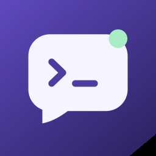
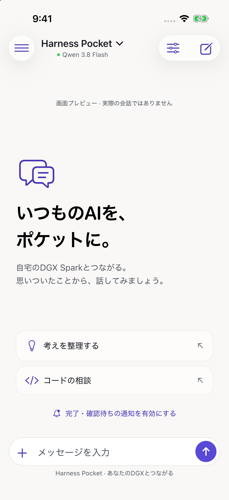
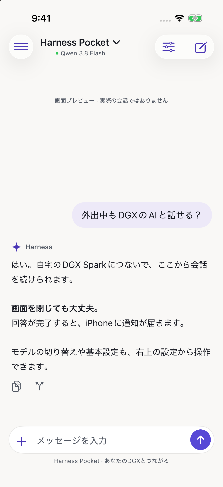
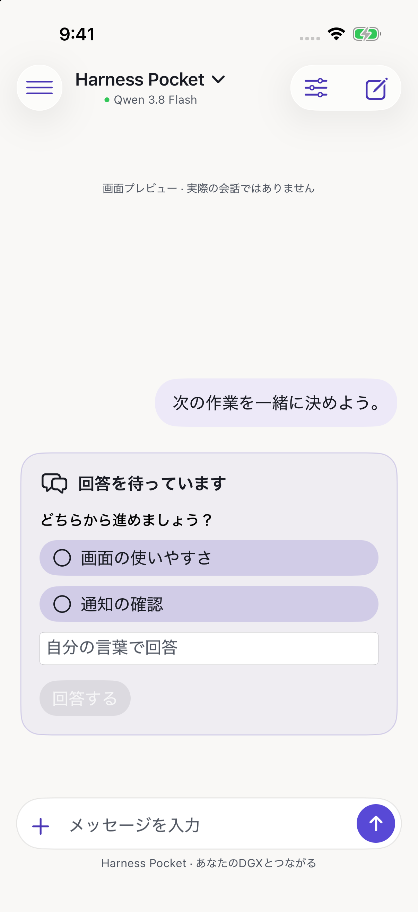

<p align="center"></p>
<h1 align="center">Harness Pocket</h1>
<p align="center"><strong>自宅のAIエージェントを、ポケットに。</strong><br>iPhoneから仕事を頼んで、質問・承認・完了のタイミングで通知を受け取る。</p>
<p align="center"><a href="README.md">English</a> · 日本語</p>

[DeepSeek Harness](https://github.com/deepseek-ai/deepseek-harness) をiPhoneから操作する、非公式のSwiftUIアプリです。
自宅のHarnessと小さなNode.js Gatewayを、TailscaleのHTTPS経由でつなぎます。

**依頼する → アプリを閉じる → 質問や承認の通知が届く → 同じ会話から続ける。**

<p align="center">
  
  
  
</p>
<p align="center"><sub>デモ用データを表示したSimulatorの実画面です。個人の会話は使用していません。</sub></p>

## できること

- 回答・推論のストリーミング、履歴、モデル変更、分岐、実行停止
- **回答完了・権限確認・質問待ちのプッシュ通知**と、該当会話への移動
- 実行許可・拒否、権限プリセット、質問への回答をボタンで選択
- 写真・ファイル添付、送信前プレビュー、添付を含む下書き
- ホストの既存フォルダを選択、Harnessの対応設定・プロバイダ・認証情報をアプリで管理
- DSH再起動後の接続先・認証の自動更新と、アプリ内の接続修復
- 差分配信と遅延描画による描画負荷の抑制

## まず画面を試す

MacのXcodeで `ios/HarnessPocket.xcodeproj` を開き、iPhone Simulatorを選びます。
**Product → Scheme → Edit Scheme → Run → Arguments** に `--demo` を追加して実行してください。

画面プレビューにはDGX、Apple Developerの有料登録、APIキー、サーバーは不要です。
デモデータを表示し、モデルへの依頼は送信しません。
`--welcome-qa` を追加すると新規チャット、`--question-qa` を追加すると質問カードを表示できます。

## 自分の環境で使う

| 用意するもの | 内容 |
| --- | --- |
| ホスト | DeepSeek Harness、Node.js 22以上、Tailscale。常駐サービスの設置スクリプトはLinux/systemd用 |
| iPhone | iOS 17以上、ホストと同じtailnetに接続したTailscale |
| ビルド | MacとXcode。実機には自分のBundle IDと署名チームを設定 |
| プッシュ通知 | Apple Developer Programの登録、自分のAPNs `.p8` キー |

**[日本語の導入手順 →](docs/IPHONE-SETUP.md)** · [English setup](docs/SETUP.md)

実接続を確認した環境はDGX Spark / DSH 0.1.2-rc.1です。別のホストや新しいDSHでの互換性は個別に確認が必要です。
通知を設定しなくてもチャットは利用できます。現在、一般向けApp Store/TestFlight配布はなく、自分でビルド・署名して使います。

## 接続の仕組み

```text
iPhone → TailscaleのHTTPS → Pocket Gateway → DeepSeek Harness
                              ↓
                          Apple APNs → iPhoneへの通知
```

モデル実行・会話・設定はHarnessが担当し、Gatewayが端末登録・通知・iPhone向けの差分配信を受け持ちます。
推論に使うモデルとプロバイダはHarness側の設定に従います。
APNsへ送る通知は汎用の案内と会話を開くための識別子で、会話本文や質問本文は含めません。

Tailscale **Serve**を自分のtailnet内で使ってください。信頼する本人端末向けの構成です。
詳しくは [SECURITY.md](SECURITY.md) を参照してください。

## 開発と検証

```sh
cd gateway
npm ci --ignore-scripts
npm test
```

CIでNode.js 22・24のGatewayテストとiOS Simulator向けビルドを実行します。
[検証記録](docs/VERIFICATION.md) / [コントリビュート](CONTRIBUTING.md)

現在はDSH専用・日本語UIです。一般ファイルのAPIがないDSHでは、添付をホストへ保存してパスで参照します。
画像の理解はモデルの対応状況によります。実iPhoneの温度・消費電力は未測定です。
通知は集中モードや通信状態の影響を受け、即時表示を保証しません。リアルタイム音声には未対応です。

## ライセンス

[MIT](LICENSE)。コードから描画した独自アイコンも同じライセンスです。
[DeepSeek Harness](https://github.com/deepseek-ai/deepseek-harness) と [ws](https://github.com/websockets/ws) はそれぞれMITライセンスで提供されています。
DeepSeek・NVIDIA・Apple・Tailscaleの公式製品ではありません。
