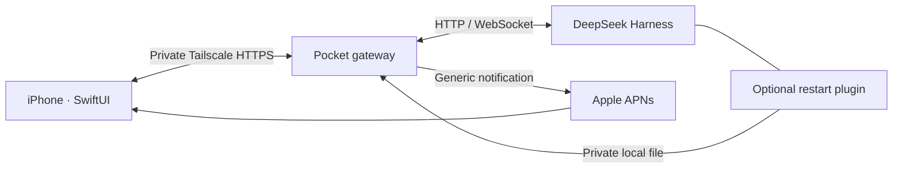

<p align="center"></p>
<h1 align="center">Harness Pocket</h1>
<p align="center"><strong>Your self-hosted AI agent, in your pocket.</strong><br>Start work from your iPhone. Get a notification when your agent needs you.</p>
<p align="center">
  <a href="https://github.com/akinadayo/harness-pocket/actions/workflows/ci.yml"></a>
  <a href="LICENSE"></a>
  
  
</p>
<p align="center">English · <a href="README.ja.md">日本語</a></p>

Harness Pocket is an independent, native SwiftUI client for
[DeepSeek Harness](https://github.com/deepseek-ai/deepseek-harness).
It connects your iPhone to Harness running on your own machine, with a small
Node.js gateway and private Tailscale HTTPS access.

**Send a task → put your phone away → get a question or approval notification → continue from the same conversation.**

<p align="center">
  
  
  
</p>
<p align="center"><sub>Actual Simulator screenshots using bundled demo data. The app UI is currently Japanese.</sub></p>

## What you can do

- **Chat and follow work:** streamed answers and reasoning, history, model selection, cancellation, and conversation branching.
- **Respond when needed:** push notifications for completion, execution approval, and follow-up questions. Tap a notification to open its conversation.
- **Approve with buttons:** respond to execution requests and select the permission presets exposed by Harness.
- **Bring context:** attach photos and files, preview them before sending, and keep attachments in drafts.
- **Configure from your phone:** browse host folders, change supported Harness settings, manage providers and credentials, and repair the connection.
- **Resume after restarts:** an optional DSH plugin hands the gateway the new port and startup token. Conversation recovery and notification monitoring run on the host.
- **Keep rendering light:** batched stream updates, lazy chat rows, and collapsed saved reasoning.

## Try the UI first

On a Mac with Xcode, clone this repository and open `ios/HarnessPocket.xcodeproj`.
Choose an iPhone Simulator, then add `--demo` in
**Product → Scheme → Edit Scheme → Run → Arguments** and run.

This preview needs **no DGX, Apple Developer membership, API key, or live server**.
It uses synthetic messages and does not send prompts. Add `--welcome-qa` to see
the welcome screen, or `--question-qa` to see answer choices.

## Connect your own Harness

| Component | Requirements |
| --- | --- |
| Host | DeepSeek Harness, Node.js 22+, Tailscale; service installer targets Linux with systemd |
| iPhone | iOS 17+, Tailscale connected to the same tailnet |
| Build | Mac with Xcode; your own bundle identifier and signing team for a physical device |
| Push notifications | Apple Developer Program membership and your own APNs `.p8` key |

The live host setup has been verified on **DGX Spark** with DSH **0.1.2-rc.1**.
Other hosts and newer DSH versions need compatibility checks. Chat works without
APNs; background push delivery needs the Apple configuration above.

**[Full setup guide →](docs/SETUP.md)** · [日本語の導入手順](docs/IPHONE-SETUP.md)

There is currently no public App Store or TestFlight distribution. Build and
sign your own copy. The maintainer's personal Apple account is not required.

## How it connects



The gateway runs beside DSH. Harness owns the model execution, conversations,
and settings; the gateway handles device pairing, notification delivery and
mobile-friendly event updates. Your model/provider is the one configured in
Harness. APNs alerts contain generic notices and routing IDs, not conversation text.

Use Tailscale **Serve**, scoped to your tailnet. This is a personal client for
trusted devices, not a multi-user hosting service. See [Security](SECURITY.md).

## Development

```sh
cd gateway
npm ci --ignore-scripts
npm test
```

```sh
xcodebuild -project ios/HarnessPocket.xcodeproj -scheme HarnessPocket \
  -configuration Debug -sdk iphonesimulator \
  -destination 'generic/platform=iOS Simulator' CODE_SIGNING_ALLOWED=NO build
```

CI runs the gateway suite on Node.js 22 and 24 and builds the iOS Simulator app.
See [Contributing](CONTRIBUTING.md) for preview modes and project generation.

## Status and limitations

This is an early project extracted from a daily-use personal client.

- **DSH-specific:** it is not a general client for every agent backend. The inspected upstream revision and event contract are in [UPSTREAM.md](docs/UPSTREAM.md).
- **Japanese app UI:** English localization is welcome; the setup documentation is bilingual.
- **File fallback:** on DSH versions without a general file upload API, files are retained privately on the host and referenced by path. Image input depends on the configured model's capabilities.
- **Notifications:** Apple acceptance does not guarantee immediate display. Focus modes, connectivity and iOS settings affect delivery. Question notifications are held during DSH disconnection until the question is reannounced.
- **Device performance:** Simulator checks are recorded, but real-device temperature and power consumption have not been measured.
- **No realtime voice or public-hosting mode.**

[Verification](docs/VERIFICATION.md) · [Notifications](docs/NOTIFICATIONS.md) · [Restart recovery](docs/RECONNECTION.md)

## License and credits

[MIT](LICENSE). The original geometric icon is included under the same license;
regenerate it on macOS with `swift scripts/create-icon.swift`.

Built against [DeepSeek Harness](https://github.com/deepseek-ai/deepseek-harness)
(MIT), using [ws](https://github.com/websockets/ws) (MIT). Dependency licenses remain
with their respective authors. Harness Pocket is an independent community project
and is not affiliated with DeepSeek, NVIDIA, Apple, or Tailscale.
